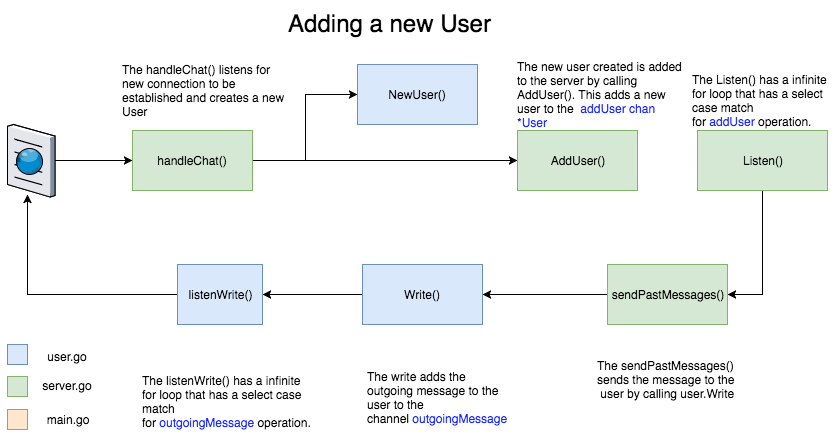
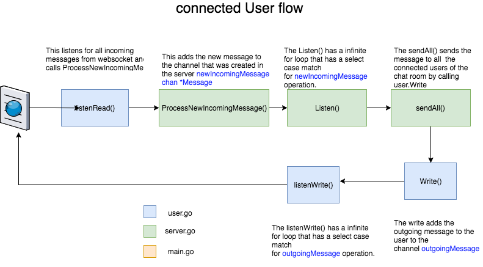

### Summary
This golang chat application is built with help of websocket.
#### Websocket
Websocket protocol is bidirectional and extensively matches for building a chat room. In chatroom apps,  we need to open an interactive communication session between the user's browser and a server for bidirectional communication of messages. These days most of the popular browsers support websocket , so its best to use websocket.
#### Gorilla Websocket
In this example i am using  [gorilla websocket](https://github.com/gorilla/websocket) lib  Instead of using native golang.org/x/net.
When i was searching about websockets in golang, this seems to be popular.
#### golang Channels
Channels are popular in golang for sharing data. In the golang training i took, the trainer was quoting ```Don't communicate by sharing memory, share memory by communicating.``` from https://blog.golang.org/share-memory-by-communicating . So Channels are used to share data between different go routines in this example.

### Organisation of files
| File name | Description |
| -----| ---|
| main.go | This is startup file. The `init()` , which by defualt gets called first before `main()` initializes the necessary   configuration such as the server host,port and log files . The `main()` creates a `chat.NewServer` type and starts a `go routine` to listen on the server. Apart from it, the `main()` also create a webserver and route handler to load the inital page of the application |
| server.go | The server file has `Server` struct defined with essential fields. The `Server` glues everything together. `server.go` has different functions defined for perfoming activities in a chat room such as <ul><li> Adding a user to chatroom</li> <li> Removing a user from chat room</li><li>Brodcasting message to all users who are connected to the chat room</li><li>has the history of all the messages so far created</li></ul> The `Listen()`  is triggerd as a `go routine` from `main()`. The `Listen()` handles a separate http route `/chat` which is used by `ws` protocol for communicating with the server. The `Listen()` has an infinite `for` loop that has a `select` to match case for different channel operations  |
| user.go | The `user.go` is representation of a user. I have a struct defined called `User` which has the props for the user. `NewUser` gets created whenever a new websocket connection is established. There are two main functions here `listenRead()` and `listenWrite()` that helps in listening for new incoming and outgoing messages. `listenWrite()` is triggered as a separate `go routine` |
| message.go | This is a simple struct that defines how a message look like |
| configuration.go | This file helps in setting up the initial configuration of the system by reading the config.json |
|config.json| All the configurable properties are set here |
| chat.html | This is the only html file that defines how the chat app looks like and has JS code to send and recieve websocket frames and display them accordingly |


### Flow diagrams (made with https://www.draw.io and data in images/)


